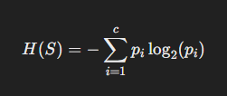
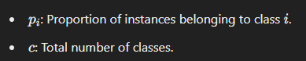
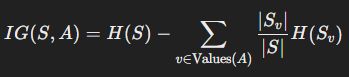
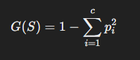
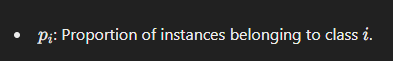
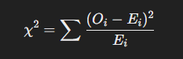
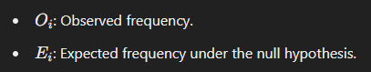

# Decision Tree Overview

A **Decision Tree** is a supervised machine learning algorithm used for classification and regression tasks. It represents decisions and their possible consequences in a tree-like structure.

## Components of a Decision Tree
- **Root Node**: Represents the entire dataset and is split into branches.
- **Decision Nodes**: Intermediate nodes that represent tests or decisions on attributes.
- **Leaf Nodes**: Represent the outcome or final decision.

## How a Decision Tree Works
1. **Select the Best Split**:
   - Evaluate all features and their possible split points.
   - Use criteria like **Entropy**, **Gini Index**, or **Chi-square** to choose the best split.
2. **Recursive Partitioning**:
   - Divide the dataset into subsets based on the selected split.
   - Repeat the process for each subset.
3. **Stopping Criteria**:
   - Stop growing the tree when a predefined condition is met (e.g., depth limit, minimum samples per node, or no further improvement in splitting criteria).
4. **Prediction**:
   - For a new data point, traverse the tree from the root to a leaf node based on the feature values.

<br>

## Metrics Used in Decision Trees

### **Entropy**
Entropy measures the level of uncertainty or impurity in a dataset. It is calculated as:





**Interpretation**:
- If all instances belong to a single class, \( H(S) = 0 \) (pure).
- If instances are evenly distributed across all classes, \( H(S) \) is maximum.

<br>

### **Information Gain**
Information Gain measures the reduction in entropy after a dataset is split on a feature. It is given by:



- **\(S\)**: Dataset before the split.
- **\(A\)**: Attribute being split.
- **\(Sv\)**: Subset of \(S\) where \(A\) has value \(v\).

**Use**: Choose the feature with the highest Information Gain as the splitting criterion.

<br>

### **Gini Index**
The Gini Index measures impurity in the dataset. It is given by:





**Interpretation**:
- \( G(S) = 0 \): Dataset is pure.
- Higher \( G(S) \): Greater impurity.

**Use**: Select the feature that minimizes the Gini Index after splitting.

<br>

### **Chi-Square**
Chi-square is a statistical test to measure the association between categorical features and the target class. It is calculated as:





**Use**: A high Chi-square value indicates a strong association between the feature and the target, making it a good candidate for splitting.

<br>

## Comparison of Metrics
| **Metric**          | **Focus**                   | **Best Value** | **Usage**                                     |
|----------------------|-----------------------------|----------------|-----------------------------------------------|
| Entropy              | Measures uncertainty        | 0 (pure)       | Works well with categorical data.             |
| Information Gain     | Reduction in entropy        | High value     | Prefers features with higher discriminative power. |
| Gini Index           | Measures impurity           | 0 (pure)       | Commonly used in CART (Classification and Regression Trees). |
| Chi-square           | Statistical association     | High value     | Best for categorical target variables.        |

<br>

## Implementing Metrics in Python
Here are examples of how to calculate and use these metrics in Python.

### **Entropy and Information Gain**
```python
import numpy as np
from math import log2

def entropy(y):
    classes, counts = np.unique(y, return_counts=True)
    probabilities = counts / len(y)
    return -sum(p * log2(p) for p in probabilities if p > 0)

def information_gain(X, y, feature_index):
    total_entropy = entropy(y)
    values, counts = np.unique(X[:, feature_index], return_counts=True)
    weighted_entropy = sum((counts[i] / len(X)) * entropy(y[X[:, feature_index] == values[i]]) for i in range(len(values)))
    return total_entropy - weighted_entropy
```

### **Gini Index**
```python
import numpy as np

def gini_index(y):
    classes, counts = np.unique(y, return_counts=True)
    probabilities = counts / len(y)
    return 1 - sum(p ** 2 for p in probabilities)
```

### **Chi-Square**
```python
import numpy as np

def chi_square(observed, expected):
    return sum(((o - e) ** 2) / e for o, e in zip(observed, expected) if e > 0)

# Example
observed = [50, 30, 20]
expected = [40, 40, 20]
chi_square_value = chi_square(observed, expected)
print("Chi-square value:", chi_square_value)
```
