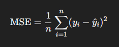

# Linear Regression

Linear regression is a basic statistical method used to model the relationship between a dependent variable (**𝑦**) and one or more independent variables (**𝑥**). In simple terms, it's a way to find the best-fitting straight line through a set of data points.

### How It Works with 𝑦 = 𝑚𝑥 + 𝑐
* Equation: 𝑦 = 𝑚𝑥 + c is the equation of a straight line
    * y: The predicted value (dependent variable).
    * x: The input or feature (independent variable).
    * m: The slope of the line (how much y changes for a unit change in x).
    * c: The y-intercept (the value of y when 𝑥 = 0).

### Steps in Linear Regression
1. **Plot the Data:** Start with a set of data points plotted on a graph.
2. **Fit a Line:** The goal is to find the line that best fits the data points.
    * This involves finding values for 𝑚 (slope) and 𝑐 (intercept).
3. Minimize Error: The line is chosen so that the total error (difference between actual 𝑦 values and predicted 𝑦 values from the line) is minimized.
    * The most common method is to minimize the "sum of squared errors."

### Example
Imagine you are predicting the price of a house (𝑦) based on its size (𝑥):
* If the slope 𝑚 = 200 and the intercept 𝑐 = 50, the equation 𝑦 = 200𝑥 + 50 means:
    * For every additional square foot (𝑥), the price (𝑦) increases by $200.
    * Even if the house has 0 square feet (𝑥 = 0), the base price is $50.
This is the foundation of linear regression! The simplicity of 𝑦 = 𝑚𝑥 + 𝑐 makes it a great starting point for understanding relationships in data.

## Cost Function
A **cost function** measures how well a machine learning model (like linear regression) fits the data. It's like a "score" that tells us how far off our predictions are from the actual values.
In the context of linear regression, the most commonly used cost function is the **Mean Squared Error (MSE)**.

### How the Cost Function Works
1. **Predictions and Errors:**
* For each data point, the model predicts a value (𝑦^) using the equation 𝑦 = 𝑚𝑥 + 𝑐.
* The error is the difference between the actual value (𝑦) and the predicted value (𝑦^).

2. **Squaring the Errors:**
* To avoid negative and positive errors canceling each other out, we square the differences: (y-y^)2.
* **Average the Squared Errors:**

    

* **Minimizing the Cost:**
* The goal of training is to adjust 𝑚 (slope) and 𝑐 (intercept) to make the cost function as small as possible.
* A smaller MSE means the model is predicting better.

### Why Squared Errors?
* Squaring the errors emphasizes larger mistakes. If a prediction is very far off, it has a bigger impact on the cost, encouraging the model to focus on those errors.

### Simple Example
Let's say you have these data points for 𝑥 and 𝑦:
* Actual values (𝑦): [3, 5, 7]
* Predictions (𝑦^) from the line: [2.5, 5.5, 6]

1. Compute the errors:
    * Errors: [3 − 2.5, 5 − 5.5, 7 − 6] = [0.5, − 0.5, 1]

2. Square the errors:
    * Squared errors: [0.52, (-0.5)2, 12] = [0.25, 0.25, 1]

3. Average the squared errors:
    * MSE: (0.25 + 0.25 + 1) / 3 = 0.5

So, the cost for this model is 0.5.

### In Summary
* The cost function tells us how well the line fits the data.
* By minimizing the cost (e.g., using gradient descent), we improve the model's predictions.

## Gradient Descent algorithm
Gradient Descent is an optimization algorithm used to find the best parameters (like 
𝑚 and 𝑐 in linear regression) that minimize the cost function. It's like walking downhill on a landscape to reach the lowest point.

### How Gradient Descent Works
1. **Start Somewhere:** Begin with random guesses for the parameters (like the slope and intercept of the line).

2. **Measure the Slope:** Check how steep the cost function is at the current point. This tells you the direction to move to reduce the cost.

3. **Take a Step:** Adjust the parameters slightly in the direction that lowers the cost (downhill).

4. **Repeat:** Keep measuring the slope and taking steps until you reach the lowest point, where the cost is minimized.

### Key Ideas
* **Learning Rate:** Controls the size of each step. If it's too small, the process is slow. If it's too big, you might overshoot the minimum.

* **Convergence:** The process stops when the steps become very small, meaning you're close to the lowest cost.

Gradient Descent helps machines "learn" by improving their predictions step by step.