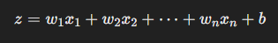
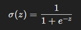
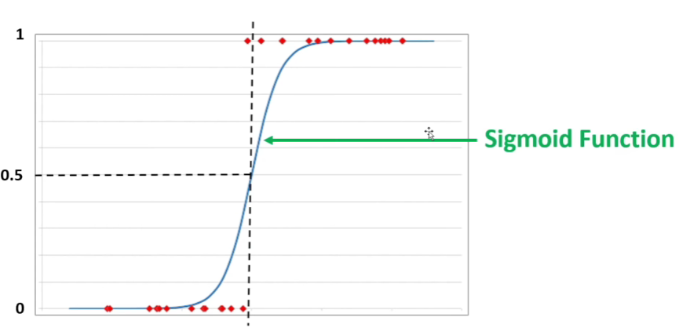

# Logistic Regression

### What is Logistic Regression?

Logistic Regression is a machine learning algorithm used for **classification tasks**, meaning it predicts which category or class something belongs to. For example:

- Will a customer buy a product? (Yes/No)
- Is an email spam or not? (Spam/Not Spam)
- Is a tumor malignant or benign? (Malignant/Benign)

 

## How Does Logistic Regression Work?

### 1. Linear Relationship

Logistic Regression starts by calculating a linear equation:

- \(x_1, x_2, \dots, x_n\): Input features (like age, income, etc.)
- \(w_1, w_2, \dots, w_n\): Weights (adjusted during training to improve predictions)
- b: Bias (a constant added to the equation)

### 2. Sigmoid Function

Instead of using the raw linear value z, Logistic Regression applies the **sigmoid function** to convert z into a probability:

This ensures the output is always between 0 and 1. For example:

- If the result is 0.8, it means an 80% chance of belonging to class 1.
- If the result is 0.2, it means a 20% chance of belonging to class 1.

### 3. Threshold Decision

- If the probability is greater than a threshold (e.g., 0.5), the prediction is class 1.
- If it's less than the threshold, the prediction is class 0.

 

## Training the Model

Logistic Regression learns by adjusting the weights and bias to minimize error. This is done using:

- **Cost Function**: Measures the difference between predicted probabilities and actual outcomes.
- **Gradient Descent**: Updates weights and bias step-by-step to reduce the cost.

 

## Why is it Called "Logistic" Regression?

The name comes from the **logistic function** (another name for the sigmoid function), which is key to converting linear outputs into probabilities.

 

## Example in Practice

Imagine predicting whether a person will buy a car based on their age and income:

1. **Input data**: Age = 30, Income = $50k.
2. **Linear equation** computes z.
3. **Sigmoid function** converts z into a probability (e.g., 0.7 or 70% chance of buying).
4. If the threshold is 0.5, the model predicts the person **will buy the car**.

 

## Binary vs. Multiclass Classification

### Binary Classification

- **Definition**: Predicts one of **two possible outcomes**.
  - Examples:
    - Will a customer buy a product? (Yes/No)
    - Is an email spam? (Spam/Not Spam)
    - Does a patient have a disease? (Positive/Negative)

- **How It Works**:
  Logistic Regression outputs a probability between 0 and 1. A threshold (commonly 0.5) is used:
  - If P > 0.5, predict Class 1.
  - If P \leq 0.5, predict Class 0.

### Multiclass Classification

- **Definition**: Predicts one of **three or more classes**.
  - Examples:
    - What type of fruit is it? (Apple, Orange, Banana)
    - What is the weather condition? (Sunny, Rainy, Cloudy)
    - What grade will a student achieve? (A, B, C, D, F)

- **How It Works**:
  Logistic Regression handles multiple classes using techniques like:

  1. **One-vs-Rest (OvR)**:
     - The model trains separate binary classifiers for each class.
     - For example, for classes A, B, and C:
       - Train one model to classify A vs. (B or C).
       - Train another to classify B vs. (A or C).
       - Train another to classify C vs. (A or B).
     - The class with the highest probability is chosen.

  2. **Softmax Function**:
     - A generalization of the sigmoid function for multiclass problems.
     - It outputs probabilities for all classes, and the highest probability determines the predicted class.

 

## Key Difference Between Binary and Multiclass Classification

| **Aspect**            | **Binary Classification**           | **Multiclass Classification**             |
|------------------------|-------------------------------------|-------------------------------------------|
| **Number of Classes**  | 2 (e.g., Yes/No)                   | 3 or more (e.g., A, B, C)                 |
| **Output**             | Single probability (e.g., 0.7 for Class 1) | Probability distribution over all classes |
| **Threshold**          | Commonly 0.5                       | Select class with the highest probability |

---

