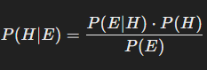
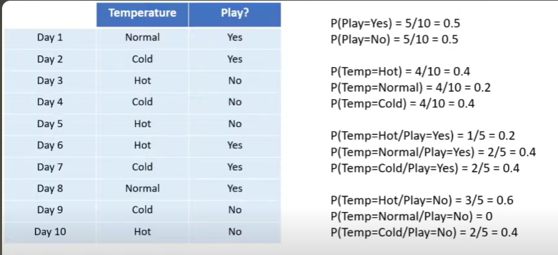
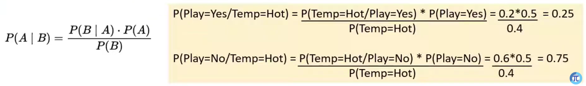
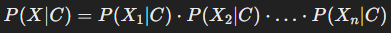
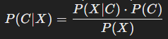
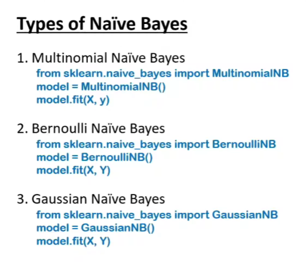
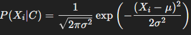
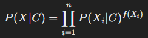
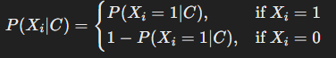

# Naive Bayes Classifier

Naive Bayes is a family of simple yet powerful probabilistic classifiers based on Bayes' Theorem. It is called "naive" because it assumes that the features (or predictors) used to make the classification are independent of each other. Despite this simplification, Naive Bayes often performs well in practice, especially for text classification and natural language processing tasks.

 

## **Bayes' Theorem**
Bayes' Theorem provides a way to calculate the probability of a hypothesis (H) given observed data (E):

Where:
- **(P(H|E))**: Posterior probability (the probability of the hypothesis given the data).
- **(P(E|H))**: Likelihood (the probability of the data given the hypothesis).
- **(P(H))**: Prior probability (the initial probability of the hypothesis).
- **(P(E))**: Evidence (the probability of the data under all possible hypotheses).

Example: 

 

## **How Naive Bayes Works**

### **Training Phase**:
1. Calculate the prior probabilities (P(C)) for each class (C).
2. Calculate the likelihood (P(X_i|C)) for each feature (X_i) given each class.
3. Assume feature independence, so the joint probability is the product of individual likelihoods:

   

### **Prediction Phase**:
1. Use Bayes' Theorem to calculate the posterior probability for each class:
   
   

2. Choose the class with the highest posterior probability as the prediction.

 

## **Types of Naive Bayes and How They Work**

### 1. **Gaussian Naive Bayes**
- Assumes that features follow a Gaussian (normal) distribution.
- Likelihood is computed as:

   

- **Usage**: Continuous data, e.g., predicting numeric outcomes, or features with a normal distribution.

### 2. **Multinomial Naive Bayes**
- Used for discrete data, especially for text classification tasks where word counts or term frequencies are used as features.
- Likelihood is calculated based on frequency counts:
  
   

  where \(f(X_i)\) is the frequency of feature \(X_i\).
- **Usage**: Document classification, spam filtering, sentiment analysis.

### 3. **Bernoulli Naive Bayes**
- Handles binary/boolean features.
- Models the presence or absence of features:
  
   

- **Usage**: Binary text classification, e.g., checking whether certain words are present in a document.

### 4. **Complement Naive Bayes**
- A variation of Multinomial Naive Bayes, designed to handle class imbalances by focusing on the complement of the target class during likelihood estimation.
- **Usage**: Similar to Multinomial Naive Bayes but better for imbalanced datasets.

### 5. **Categorical Naive Bayes**
- Works with categorical data, assuming that each feature's value is drawn from a categorical distribution.
- **Usage**: Datasets with purely categorical features.

 

## **Applications of Naive Bayes**
1. **Text Classification**:
   - Spam detection.
   - Sentiment analysis.
   - Topic modeling.

2. **Medical Diagnosis**:
   - Predicting diseases based on symptoms.

3. **Document Categorization**:
   - Organizing emails or news articles by category.

4. **Recommendation Systems**:
   - Predicting user preferences based on past behaviors.

5. **Real-Time Predictions**:
   - Due to its simplicity and speed, it is ideal for scenarios requiring quick responses.

 

## **Advantages**
- Simple to implement.
- Efficient and fast, especially with large datasets.
- Works well even with small datasets.
- Handles high-dimensional data effectively.

## **Disadvantages**
- Assumes feature independence, which may not hold in real-world data.
- Struggles with continuous data unless Gaussian Naive Bayes is used.
- Sensitive to imbalanced datasets and outliers.
