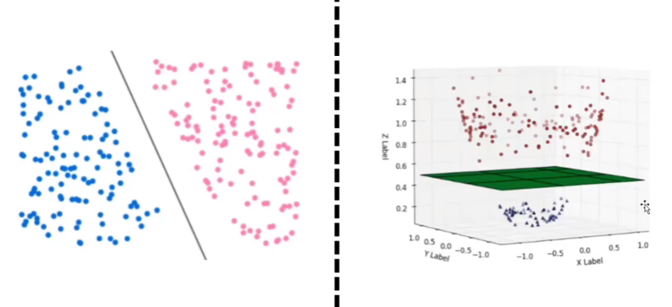
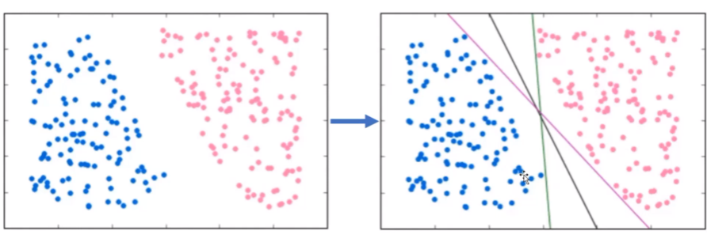
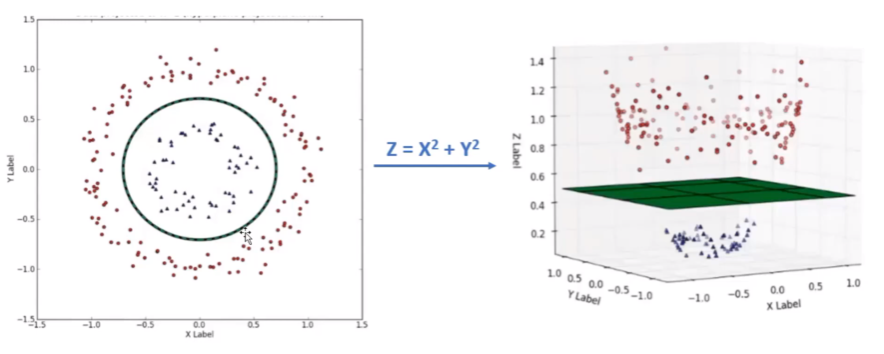

# Support Vector Machine (SVM)

## **Overview**
Support Vector Machines (SVM) is a supervised machine learning algorithm commonly used for classification and regression tasks. Its primary goal is to find a hyperplane that best separates classes of data in a high-dimensional space.

 

## **How SVM Works**

### 1. **Hyperplane and Margin**
- A **hyperplane** is a decision boundary that separates data points of different classes. In a 2D space, it’s a line; in a 3D space, it's a plane, and in higher dimensions, it’s called a hyperplane.
- SVM aims to maximize the margin, which is the distance between the hyperplane and the closest data points from each class. These closest points are called **support vectors**.

### 2. **Linear Separation**
- If the data is linearly separable, SVM finds the hyperplane with the largest margin. The equation of the hyperplane is:
  
  w . x + b = 0

  where \(w\) is the normal vector, \(x\) is the input feature vector, and \(b\) is the bias term.

### 3. **Non-linear Data**
- When data is not linearly separable, SVM uses a **kernel trick** to map the data into a higher-dimensional space where a hyperplane can separate the classes.
- Common kernel functions:
  - **Linear Kernel**: For linearly separable data.
  - **Polynomial Kernel**: For more complex relationships.
  - **Radial Basis Function (RBF) Kernel**: For non-linear data.
  - **Sigmoid Kernel**: Similar to a neural network.

### 4. **Soft Margin (C Parameter)**
- Real-world data often has noise or overlaps. The **C parameter** controls the trade-off between maximizing the margin and minimizing classification errors. A small \(C\) allows for some misclassifications to increase margin size, while a large \(C\) tries to classify all training examples correctly.

 

## **Examples of Problems Suitable for SVM**

### 1. **Binary Classification**
- **Email Spam Detection**: Classify emails as "spam" or "not spam".
- **Cancer Diagnosis**: Classify tumor samples as "benign" or "malignant".

### 2. **Multi-class Classification** (using one-vs-one or one-vs-all strategies)
- **Handwriting Recognition**: Classify handwritten digits (0–9).
- **Image Classification**: Identify objects in an image dataset (e.g., cat, dog, bird).

### 3. **Regression Tasks** (using Support Vector Regression, SVR)
- Predicting housing prices based on features like size, location, and number of rooms.

### 4. **Outlier Detection**
- **Fraud Detection**: Identify unusual transactions in a financial dataset.
- **Anomaly Detection**: Detect defects in manufacturing processes.

 

## **Advantages of SVM**
- Effective for high-dimensional data.
- Works well when the number of features exceeds the number of samples.
- Robust to overfitting, especially in high-dimensional spaces.
- Flexible with kernel functions for non-linear decision boundaries.

## **Disadvantages of SVM**
- Not suitable for very large datasets due to high computational cost.
- Sensitive to the choice of kernel, regularization parameter (\(C\)), and other hyperparameters.
- Difficult to interpret compared to simpler models like decision trees.
