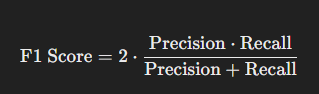

# Confusion Matrix - Precision, Recall, F1 Score

A **confusion matrix** is a tool used to evaluate the performance of a classification model by comparing its predicted labels against the actual labels. It contains information about false positives, false negatives, true positives, and true negatives.

## Confusion Matrix Structure

The confusion matrix is typically represented as:

|                     | Predicted Positive | Predicted Negative |
|---------------------|--------------------|--------------------|
| **Actual Positive**  | True Positive (TP)  | False Negative (FN) |
| **Actual Negative**  | False Positive (FP) | True Negative (TN)  |

### Key Terms:
- **True Positive (TP)**: Correctly predicted positive cases.
- **False Positive (FP)**: Incorrectly predicted as positive.
- **False Negative (FN)**: Incorrectly predicted as negative.
- **True Negative (TN)**: Correctly predicted negative cases.

 

## Performance Metrics

From this confusion matrix, several important performance metrics can be derived: **Precision**, **Recall**, and **F1 Score**.

### 1. Precision
Precision answers the question: _"Of all the positive predictions made by the model, how many were actually correct?"_

Formula:

- **High Precision** means the model makes fewer false positive errors (less chance of incorrectly classifying a negative sample as positive).
- **Low Precision** means the model frequently misidentifies negative samples as positive.

 

### 2. Recall (Sensitivity or True Positive Rate)
Recall answers the question: _"Of all the actual positives, how many did the model correctly identify?"_

Formula:

- **High Recall** means the model correctly identifies most of the actual positive samples (few false negatives).
- **Low Recall** means the model fails to identify many actual positive samples.

 

### 3. F1 Score
The **F1 Score** is the harmonic mean of Precision and Recall. It provides a balanced measure of the model’s performance by combining both metrics. The F1 score is particularly useful when you need a balance between Precision and Recall and there is an uneven class distribution (i.e., when one class is more prevalent than the other).

Formula:

- **High F1 Score** indicates both high Precision and Recall, meaning the model is performing well in both detecting positive samples and avoiding false positives.
- **Low F1 Score** suggests a trade-off, where one of the metrics (Precision or Recall) is very low, and thus the model has room for improvement.

 

## Example

Consider a classification problem where we have the following confusion matrix:

|                     | Predicted Positive | Predicted Negative |
|---------------------|--------------------|--------------------|
| **Actual Positive**  | 80 (TP)            | 20 (FN)            |
| **Actual Negative**  | 10 (FP)            | 90 (TN)            |

From this, we can calculate:

In this case, the model performs quite well, but there's room for improvement, especially in reducing false negatives (which impacts Recall).

## Key Takeaways

- **Precision** focuses on the accuracy of positive predictions.
- **Recall** focuses on the ability to find all positive instances.
- **F1 Score** provides a single metric that balances both precision and recall.

