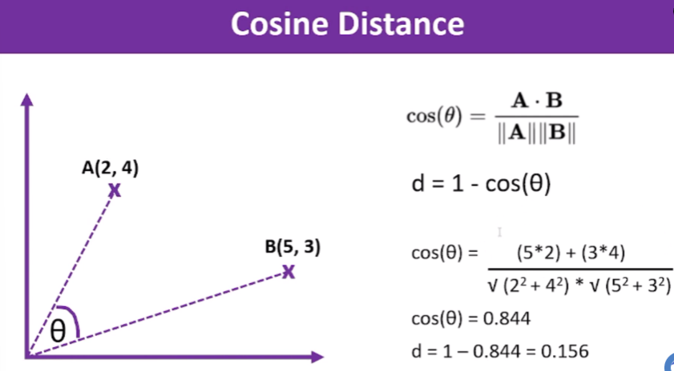

# Distance Metrics: Euclidean, Manhattan, and Cosine Distance

This document explains the concepts of Euclidean, Manhattan, and Cosine distances, their formulas, how they work, and typical use cases.

 

## 1. Euclidean Distance

- **Definition**: The straight-line distance between two points in a Euclidean space (e.g., 2D or 3D plane).
- **Formula**:  

    

  Here, \(p\) and \(q\) are points in \(n\)-dimensional space, and \(p_i\) and \(q_i\) are their coordinates in the \(i^{th}\) dimension.

- **How it Works**:  
  - Measures the actual spatial distance between points.
  - Each dimension contributes equally to the total distance.

- **Use Cases**:  
  - Suitable when the magnitude of differences matters (e.g., clustering, nearest neighbor algorithms).
  - Works best when the data is normalized if the scales of features differ.

- **Example Scenario**:  
  - Finding the shortest path between two locations on a map.

 

## 2. Manhattan Distance (L1 Distance)  

- **Definition**: Also known as "taxicab" or "city block" distance, it is the sum of the absolute differences of the coordinates.
- **Formula**:  

    

- **How it Works**:  
  - Measures the distance by traversing only along the axes (like a grid pattern).
  - Each dimension contributes independently to the total distance.

- **Use Cases**:  
  - Suitable when movement is restricted to orthogonal directions (e.g., urban grid layouts, certain types of optimization problems).
  - Works well for sparse data or when dealing with high-dimensional spaces.

- **Example Scenario**:  
  - Calculating the shortest path a taxi would take in a city grid.

 

## 3. Cosine Distance

- **Definition**: Measures the cosine of the angle between two non-zero vectors. It focuses on the orientation rather than the magnitude of the vectors.
- **Formula**:  
  First, compute cosine similarity:
  
  

- **How it Works**:  
  - Focuses on the direction of the vectors in multi-dimensional space.
  - Ignores magnitude differences, emphasizing relative patterns.

- **Use Cases**:  
  - Suitable for text analysis, document similarity, and high-dimensional data where magnitude is irrelevant.
  - Often used in recommendation systems and NLP tasks.

- **Example Scenario**:  
  - Comparing the similarity of two documents based on word frequencies.

 

## Comparison and Choosing the Right Metric

| **Metric**       | **Best For**                                               | **Sensitive to Magnitude?** | **Sensitive to Scale?** |
|-------------------|------------------------------------------------------------|-----------------------------|--------------------------|
| **Euclidean**     | Spatial distances, clustering                              | Yes                         | Yes                     |
| **Manhattan**     | Grid-based movement, high-dimensional data                 | Yes                         | No                      |
| **Cosine**        | Directional similarity, text analysis, feature vectors     | No                          | No                      |

 

## Practical Example

Consider three points in 2D: \( A(1, 2), B(4, 6), C(1, 6) \).

- **Euclidean Distance**: Measures the straight-line distance.  
  \( d(A, B) = 5 \).

- **Manhattan Distance**: Adds the horizontal and vertical distances.  
  \( d(A, B) = 7 \).

- **Cosine Distance**: Looks at the angle between vectors originating at the origin. Best for comparing relative positions rather than actual distances.

 

## Choosing the Right Metric

Choosing the right metric depends on your data's characteristics and the problem's context. Use Euclidean for spatial problems, Manhattan for grid-based or high-dimensional spaces, and Cosine for comparing relative patterns or directional similarity.

