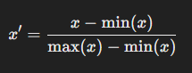

# Standardization and Normalization

## **Definitions**

### **Standardization**
- **Definition**: Standardization rescales data to have a mean (μ) of 0 and a standard deviation (σ) of 1.
  - **Formula**:

    

  - **Where**:
    - x: Original value.
    - μ: Mean of the dataset.
    - σ: Standard deviation of the dataset.

- **Key Characteristics**:
  - Retains outliers but rescales them.
  - Centers data around 0.

### **Normalization**
- **Definition**: Normalization rescales data to fit within a specific range, typically [0, 1].
  - **Formula**:

    

  - **Where**:
    - x: Original value.
    - min(x): Minimum value in the dataset.
    - max(x): Maximum value in the dataset.

- **Key Characteristics**:
  - Compresses data to a fixed range.
  - Sensitive to outliers, as they can skew the scaling.

 

## **Differences Between Standardization and Normalization**

| **Aspect**             | **Standardization**                               | **Normalization**                              |
|------------------------|-------------------------------------------------|------------------------------------------------|
| **Purpose**             | Centers around mean (0) and scales by standard deviation. | Scales data to a fixed range (e.g., [0, 1]).   |
| **Sensitivity to Outliers** | Less sensitive (uses mean and std deviation).       | More sensitive (uses min and max).            |
| **Effect**              | Maintains the distribution shape.               | Compresses or stretches the data.             |
| **Application**         | Useful for algorithms assuming Gaussian distribution. | Used for algorithms requiring bounded inputs. |

 

## **Use Cases**

### **Standardization**
- **Best Fit With**:
  - Algorithms sensitive to the scale of data or assuming Gaussian distribution.
  - **Examples**:
    - Linear Regression
    - Logistic Regression
    - Support Vector Machines (SVM)
    - Principal Component Analysis (PCA)
    - k-Nearest Neighbors (k-NN) (if based on Euclidean distance)

- **Use Case**:
  - Financial data where features like stock prices and trading volume vary widely.
  - When features have different units (e.g., weight in kg and height in cm).

### **Normalization**
- **Best Fit With**:
  - Algorithms requiring inputs within a fixed range or that are sensitive to magnitude differences.
  - **Examples**:
    - Neural Networks
    - K-Means Clustering
    - Gradient Descent-based algorithms (e.g., for deep learning models)

- **Use Case**:
  - Image data where pixel intensities are scaled to [0, 1].
  - When data must fit within a bounded range, such as probability distributions or activation functions.

 

## **Examples**

### **Standardization Example**
Dataset: [50, 60, 70, 80, 90]  
- Mean (μ) = 70  
- Standard Deviation (σ) = 15.81  
Standardized values:  

### **Normalization Example**
Dataset: [50, 60, 70, 80, 90]  
- Min = 50, Max = 90  
Normalized values:  

 

## **Conclusion**
- **Standardization**: Best for algorithms sensitive to Gaussian distributions or magnitude differences.
- **Normalization**: Best for algorithms requiring fixed ranges or that rely on magnitude.

Each technique's choice depends on the algorithm and the dataset's characteristics.
