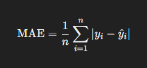
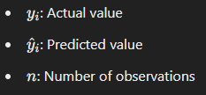
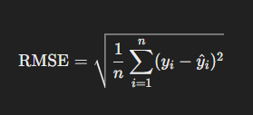
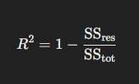
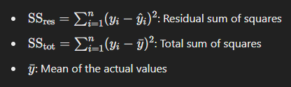
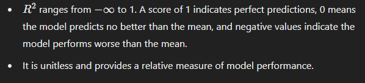

# Evaluation Metrics in Machine Learning

## Mean Absolute Error (MAE)

**Definition:**
Mean Absolute Error (MAE) is the average of the absolute differences between the predicted and actual values. It measures how much, on average, predictions differ from the actual values.

**Formula:**

Where:

**Key Insights:**
- MAE is simple to understand and directly interpretable in the context of the problem's units.
- It does not penalize large errors as much as squared-error metrics, making it less sensitive to outliers.

 

## Root Mean Squared Error (RMSE)

**Definition:**
Root Mean Squared Error (RMSE) is the square root of the average of squared differences between predicted and actual values. It is sensitive to large errors because the squaring process amplifies them.

**Formula:**

**Key Insights:**
- RMSE gives more weight to large errors, making it useful when large errors are particularly undesirable.
- Like MAE, RMSE has the same units as the target variable, but it is harder to interpret directly.

 

## R2 Score (Coefficient of Determination)

**Definition:**
The R2 score measures how well the predicted values approximate the actual values. It indicates the proportion of variance in the target variable that is explained by the model.

**Formula:**

Where:

**Key Insights:**

 

## What These Metrics Provide About ML Algorithms

1. **Model Accuracy:**
   - **MAE and RMSE** indicate how far predictions are from actual values. Lower values suggest better performance.
   - RMSE is better for capturing the impact of larger errors, while MAE provides a more general measure of error magnitude.

2. **Error Distribution:**
   - MAE treats all errors equally, while RMSE emphasizes larger errors more heavily. The comparison between these two can indicate the presence of outliers.

3. **Explained Variance:**
   - **R2** measures how much of the variability in the target variable the model explains. A high R2 suggests the model captures the relationship between inputs and outputs well.

4. **Model Comparisons:**
   - These metrics allow you to compare different models or configurations. For example, you can compare models trained on the same data using RMSE to see which handles large errors better.

5. **Use Case Suitability:**
   - The choice of metric depends on the application's goals:
     - If avoiding large errors is critical (e.g., in finance), RMSE might be preferred.
     - If interpretability is key, MAE is often better.
     - \(R^2\) is particularly useful for understanding how well a model fits the data overall.

By analyzing these metrics together, you can gain a comprehensive understanding of your model's strengths and weaknesses.
