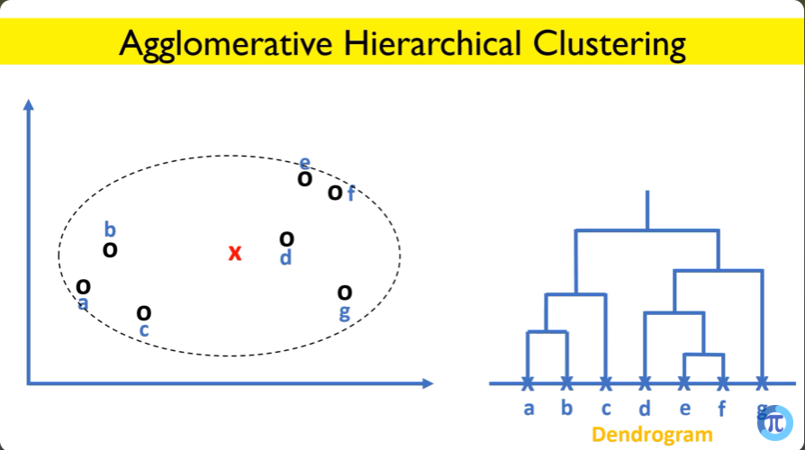

# Hierarchical Clustering

Hierarchical clustering is a type of **unsupervised machine learning algorithm** used for clustering data into a hierarchy of nested clusters. It doesn't require predefining the number of clusters and produces a dendrogram, a tree-like structure that shows how clusters are merged or divided.

 

## How Hierarchical Clustering Works
Hierarchical clustering works in two main approaches:

### 1. Agglomerative (Bottom-Up Approach)
- Starts with each data point as its own cluster.
- Iteratively merges the two closest clusters until a single cluster remains or a stopping condition is met.

**Key Steps:**
1. Compute the distance (or similarity) matrix between all data points.
2. Identify the two closest clusters and merge them.
3. Update the distance matrix to reflect the new cluster.
4. Repeat until a single cluster or predefined stopping criterion is achieved.

### 2. Divisive (Top-Down Approach)
- Starts with all data points in one single cluster.
- Recursively splits clusters into smaller clusters until each data point is its own cluster or a stopping condition is met.
- Less commonly used than agglomerative due to higher computational complexity.

 

## Distance Metrics and Linkage Criteria
The algorithm relies on distance metrics and linkage criteria to decide how clusters are formed.

### Common Distance Metrics:
- Euclidean distance
- Manhattan distance
- Cosine similarity

### Linkage Criteria
Determines how the distance between clusters is calculated:
1. **Single Linkage**: Minimum distance between points in two clusters.
2. **Complete Linkage**: Maximum distance between points in two clusters.
3. **Average Linkage**: Average distance between all points in two clusters.
4. **Centroid Linkage**: Distance between the centroids of two clusters.
5. **Ward’s Linkage**: Minimizes the increase in total variance when clusters are merged.

 

## Types of Hierarchical Clustering

1. **Agglomerative Clustering (Bottom-Up)**
   - Suitable for datasets where local cluster structure matters.
   - Simpler and more commonly used.

   

   

   

   

   

   

2. **Divisive Clustering (Top-Down)**
   - Better for datasets where global structure is more important.
   - Computationally expensive but provides different insights.

 

## When to Use Hierarchical Clustering
Hierarchical clustering is suitable for problems where:
- The number of clusters is unknown and needs exploration.
- A hierarchy of clusters is useful for interpretation.
- The data doesn't fit well into predefined clusters (e.g., non-spherical clusters).
- Insights into how clusters are formed are required (e.g., in dendrograms).

 

## Use Cases of Hierarchical Clustering
1. **Market Segmentation**: Group customers with similar buying behavior for targeted marketing strategies.
2. **Document Classification**: Organize documents or text data based on similarity.
3. **Gene Expression Analysis**: Cluster genes with similar expression patterns in bioinformatics.
4. **Image Segmentation**: Group similar pixels or regions in images for object detection.
5. **Social Network Analysis**: Identify communities within networks based on interaction patterns.
6. **Anomaly Detection**: Detect outliers in datasets by observing clusters with sparse points.

 

## Advantages and Disadvantages

### Advantages
- Doesn’t require specifying the number of clusters upfront.
- Produces a dendrogram, providing a visual representation of cluster relationships.
- Captures nested cluster structures.

### Disadvantages
- Computationally expensive for large datasets.
- Sensitive to noise and outliers.
- The choice of distance metric and linkage criteria can significantly affect results.

 

By carefully choosing the linkage method and distance metric, hierarchical clustering can provide insightful and interpretable clustering results for various types of data.
