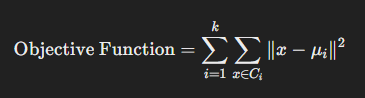
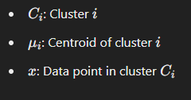
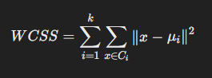
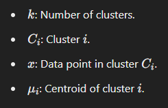

# K-Means Clustering & Elbow Method

This README explains the **K-Means Clustering** algorithm, the **WCSS (Within-Cluster Sum of Squares)** error, and the **Elbow Method** used for determining the optimal number of clusters.

 

## **K-Means Clustering**

### **Overview**

K-Means is an unsupervised machine learning algorithm used to partition a dataset into \( k \) clusters. It groups similar data points together based on their characteristics and aims to minimize the within-cluster variance.

### **How K-Means Works**

1. **Initialization**:
   - Choose the number of clusters, \( k \).
   - Randomly initialize \( k \) centroids (or choose them from the data points).

2. **Assignment Step**:
   - Assign each data point to the nearest centroid using a distance metric, typically Euclidean distance.

3. **Update Step**:
   - Recalculate the centroids as the mean of all the data points assigned to each cluster.

4. **Repeat**:
   - Alternate between the assignment and update steps until:
     - The centroids stabilize (no significant changes), or
     - A maximum number of iterations is reached.

5. **Output**:
   - The final clusters and their centroids.

### **Mathematical Objective**

The algorithm minimizes the **sum of squared distances (SSD)** between each data point and the centroid of its assigned cluster:

Where:

### **Use Cases**

- **Market Segmentation**: Group customers based on purchasing behavior or preferences.
- **Image Compression**: Reduce the number of colors in an image by clustering similar colors.
- **Document Clustering**: Organize documents based on content similarity.
- **Anomaly Detection**: Identify outliers that do not fit well into any cluster.
- **Recommendation Systems**: Group users or items for personalized recommendations.
- **Geospatial Analysis**: Cluster geographic data or segment regions.
- **Social Network Analysis**: Detect communities or groups of users based on interactions.

### **Advantages**

- Simple and easy to implement.
- Scalable to large datasets.
- Fast convergence in many cases.

### **Limitations**

- Requires predefining \( k \), the number of clusters.
- Sensitive to initial centroid placement (can lead to suboptimal results).
- Assumes spherical, equally sized clusters.
- Struggles with clusters of varying density or shape.

### **Variants**

- **K-Means++**: Improves the initialization of centroids to speed up convergence.
- **Mini-Batch K-Means**: More efficient for large datasets using small batches.
- **Fuzzy C-Means**: Allows soft assignment of data points to clusters instead of hard assignments.

 

## **WCSS (Within-Cluster Sum of Squares)**

WCSS is a metric used to evaluate how tightly grouped the data points within a cluster are. It measures the total variance within the clusters. Lower WCSS indicates better cluster cohesion.

### **Formula for WCSS**

Where:

 

## **Elbow Method**

The **Elbow Method** is a technique for selecting the optimal number of clusters for K-Means clustering. It uses WCSS to evaluate the clustering performance as the number of clusters increases.

### **Steps for the Elbow Method:**

1. **Run K-Means for different values of \( k \)** (e.g., \( k = 1, 2, 3, \dots, n \)).
2. **Calculate WCSS** for each value of \( k \).
3. **Plot WCSS vs. \( k \)**:
   - \( k \): Number of clusters (x-axis).
   - WCSS: Within-cluster sum of squares (y-axis).
4. **Identify the elbow point**:
   - The point where the rate of reduction in WCSS slows down significantly.
   - This "elbow" indicates the optimal number of clusters.

### **Why Use the Elbow Method?**

- It helps balance between **cluster quality** (minimizing WCSS) and **simplicity** (avoiding excessive clusters).
- The elbow point typically suggests the optimal value for \( k \).

 

## **Conclusion**

K-Means clustering is a powerful unsupervised machine learning algorithm that can be used for a wide range of applications such as market segmentation, anomaly detection, and more. The Elbow Method provides an intuitive way to determine the best number of clusters by evaluating the WCSS error as \( k \) increases.
